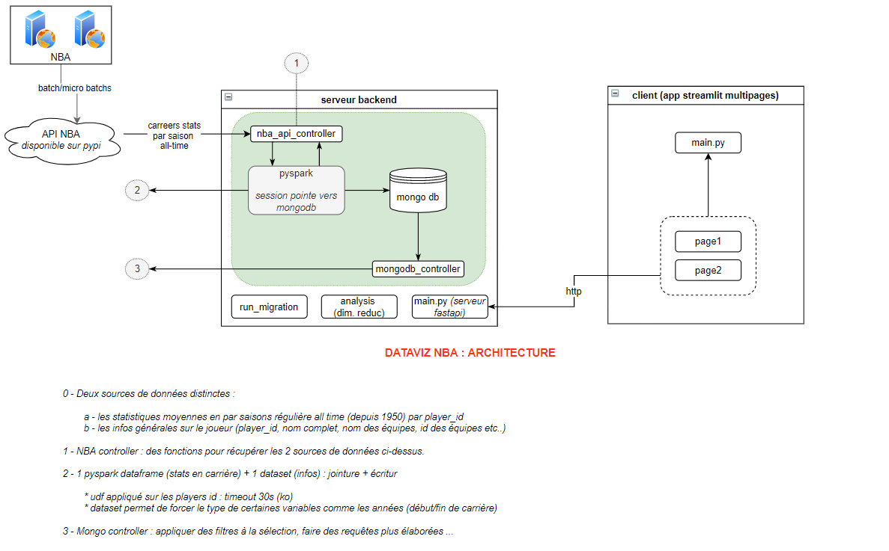

# NBA Dataviz : Who is the goat ? 

##### Environnement technique : MongoDB + pyspark + fastapi + streamlit

Requirements : ce projet nécéssite d'avoir un serveur mongodb en local et pyspark.

##### Après avoir cloné ce repos :

- Dans la racine, créez un environnement virtuel : 
```
python -m venv venv 
```
- activez l'environnement virtuel depuis la racine : 
```
venv/scripts/activate 
```
- installer les requirements depuis la racine : 
```
pip install -r requirements.txt 
```
- se placer dans le répertoire du serveur et lancer le serveur avec : 
```
python uvicorn main:app --reload
```
- se placer dans le répertoire du client et lancer le client avec : 
```
streamlit run app.py
```

## Fonctionnement du projet

